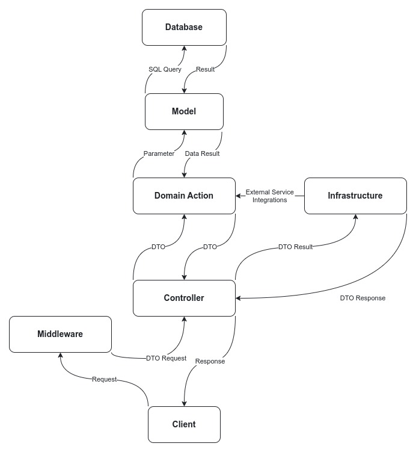

# 🗄️ Project Structure

The `domain-driven-laravel` repository is structured to promote modularity, maintainability, and scalability, aligning with Domain-Driven Design (DDD) principles. Most of the code resides in the `app` directory, organized as follows:

```sh
app
├── Console
│   └── Commands              # Custom Artisan commands for the application
├── Domain                    # Core domain logic and business rules
│   └── {NameDomain}          # Replace with actual domain name
│       ├── Actions           # Encapsulated business logic
│       ├── Casts             # Custom attribute casting classes
│       ├── Channels          # Broadcasting channels for real-time events
│       ├── Commands          # Domain-specific commands
│       ├── Data              # Data Transfer Objects (DTOs)
│       ├── Enums             # Enumerations for domain-specific constants
│       ├── Events            # Domain events for event-driven architecture
│       ├── Exceptions        # Custom exceptions for error handling
│       ├── Jobs              # Queueable jobs for asynchronous processing
│       ├── Listeners         # Event listeners for handling domain events
│       ├── Mail              # Mailable classes for sending emails
│       ├── Models            # Eloquent models representing domain entities
│       ├── Notifications     # Notification classes for user alerts
│       ├── Observers         # Model observers for managing entity lifecycle events
│       ├── Policies          # Authorization policies for access control
│       ├── Providers         # Service providers for domain services
│       ├── Resources         # API resources for formatting JSON responses
│       ├── Scopes            # Eloquent query scopes for reusable query logic
│       ├── Services          # Domain services for implementing business logic
│       ├── Traits            # Reusable traits for shared functionality
│       ├── Transformers      # Transformers for formatting data
│       └── ViewModels        # View models for preparing data for the presentation layer
├── Infrastructure            # Infrastructure-related code
│   ├── API
│   │   ├── Data              # DTOs and data transformations specific to API
│   │   └── Enum              # API-specific enumerations
│   ├── Exceptions            # Infrastructure-level exceptions
│   ├── Middleware            # HTTP middleware for request and response handling
│   └── Services              # Services related to infrastructure concerns
└── resources
    └── stubs                 # Customizable stubs for generating project files
        ├── ddd               # Stubs for domain-driven design classes
        └── infrastructure    # Stubs for infrastructure-related classes
```

## Domain

The `Domain` directory is the heart of your application, encapsulating all core business logic and rules. Each subdirectory represents a distinct domain within the application, with classes organized by their role in maintaining and enforcing the domain logic.



### {NameDomain}

Replace `{NameDomain} ` with the actual domain name in your project. Each domain should have the following structure:

-   **🚀 Actions**: Business logic encapsulated in action classes, responsible for executing specific tasks within the domain.
-   **🔄 Casts**: Custom casting classes for handling data types in Eloquent models.
-   **📡 Channels**: Broadcasting channels for real-time communication within the domain.
-   **⚙️ Commands**: Commands that encapsulate tasks or operations to be executed in the domain.
-   **📦 Data**: Data Transfer Objects (DTOs) used for transferring data within the domain.
-   **🔢 Enums**: Enumerations for defining fixed sets of related constants.
-   **📅 Events**: Domain events that signal important occurrences within the domain.
-   **⚠️ Exceptions**: Custom exceptions for handling errors and exceptional cases specific to the domain.
-   **🛠️ Jobs**: Queueable jobs that perform tasks asynchronously, offloading time-consuming operations.
-   **👂 Listeners**: Event listeners that handle domain events and execute associated logic.
-   **✉️ Mail**: Mailable classes for constructing and sending emails related to the domain.
-   **🏗️ Models**: Eloquent models representing the entities within the domain.
-   **🔔 Notifications**: Classes for sending notifications related to the domain via various channels.
-   **👀 Observers**: Observers that listen to model events and trigger corresponding actions.
-   **🔐 Policies**: Authorization policies that determine user permissions within the domain.
-   **🛠️ Providers**: Service providers that register domain services and bindings.
-   **📊 Resources**: API resources that format models and collections into JSON responses.
-   **🔍 Scopes**: Eloquent query scopes for reusable query logic tailored to the domain.
-   **💼 Services**: Service classes that implement the business logic specific to the domain.
-   **🧬 Traits**: Reusable traits that provide shared functionality across multiple classes.
-   **🔧 Transformers**: Transformers that format data for presentation or API responses.
-   **🖼️ ViewModels**: Classes that prepare data for the presentation layer, often used in conjunction with views or APIs.

## Infrastructure

The `Infrastructure` directory houses all infrastructure-related code, providing the foundation for your application to interact with external systems and manage cross-cutting concerns like API integrations, middleware, and service implementations.

-   **🌐 API**: Contains API-specific data transformations and enumerations.
-   **⚡ Exceptions**: Infrastructure-level exceptions for handling errors related to infrastructure concerns.
-   **🚦 Middleware**: HTTP middleware classes that process requests and responses, handling tasks like authentication, logging, or data transformation.
-   **🛠️ Services**: Services that implement infrastructure-specific logic, such as external API calls, data storage, or messaging.

## Stubs

The `resources/stubs` directory contains customizable stubs that allow you to generate project files adhering to the project's architectural standards. These stubs are categorized based on their role in the application architecture:

-   **📜 ddd**: Stubs for generating domain-driven design (DDD) classes.
-   **🏗️ infrastructure**: Stubs for generating infrastructure-related classes.
    By following this structure, you ensure that your application remains modular, scalable, and maintainable, allowing for easy extension and modification as your project grows.
